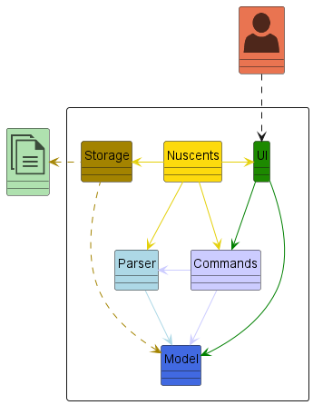
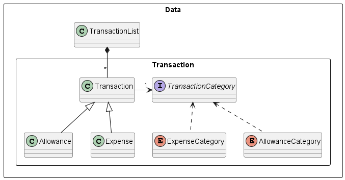
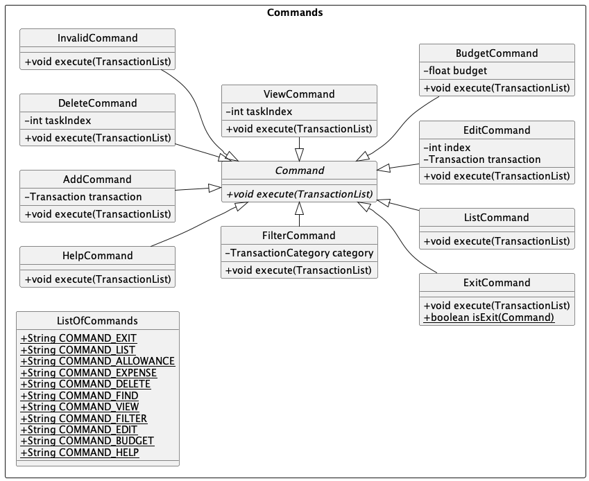
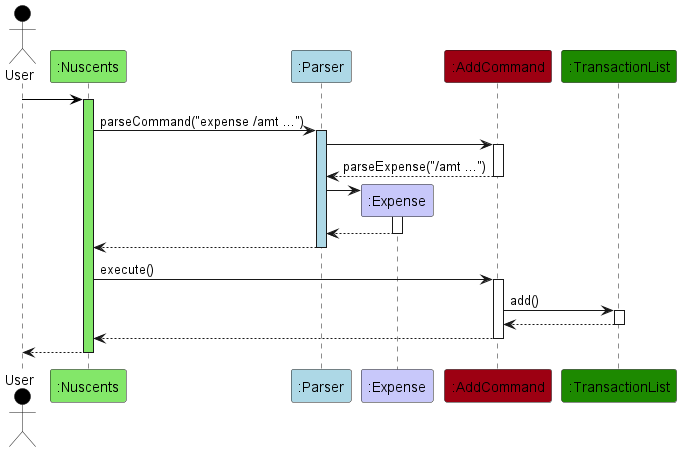
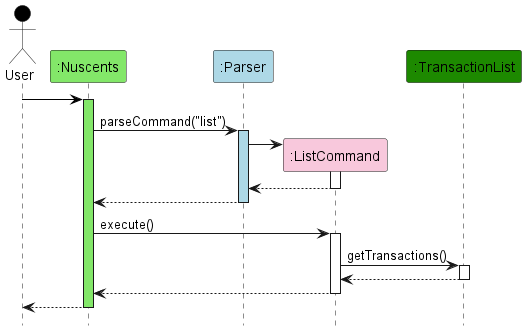
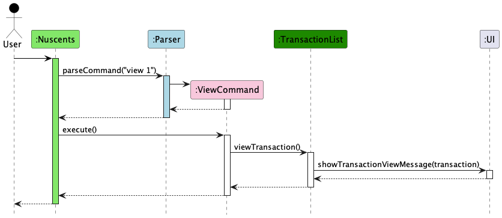
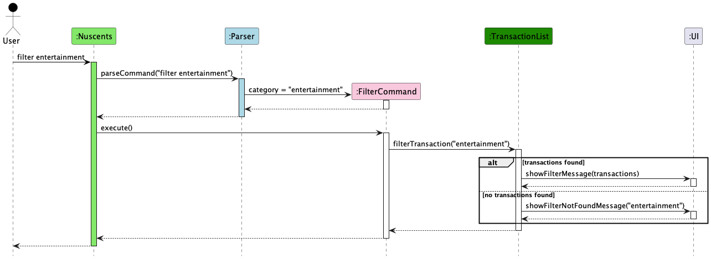

# Developer Guide

Welcome to the Developer Guide of 🪙NUScents🪙 where we have written
documentation with regards to the design and implementation of the App. In addition,
we added other related information like the product scope, user stories, non-functional
requirements, glossary and instructions for testing

## Acknowledgements

Referred to [addressbook-level3](https://se-education.org/addressbook-level3/DeveloperGuide.html) when drafting this
Developer Guide.

This project has been heavily modified from [Spaceman Task Manager](https://github.com/spaceman03/ip/).

Thanks to Dr Akshay Narayan (module coordinator) and Irving (TA) for their guidance 
throughout the course of this project.

## Design

### Architecture

The ***Architecture Diagram*** given below explains the high-level design of the 🪙NUScents🪙 App.
It depicts and provides a quick overview of how the core components interact with each other.

### Main Components:
[**`Nuscents`**](https://github.com/AY2324S1-CS2113-T18-4/tp/blob/master/src/main/java/seedu/nuscents/Nuscents.java)  is in charge of the app launch and shut down.
* At app launch, it initializes the other components in the correct sequence, and connects them up with each other.
* At shut down, it shuts down the other components and invokes cleanup methods where necessary.

The bulk of the app's work is done by the following five components:

1. **User Interface (UI):**
    - Optimized for use via a Command Line Interface (CLI).

2. **Commands:**
    - Represents user-entered commands for financial tasks.

3. **Parser:**
    - Interprets and processes user commands, extracting relevant information.

4. **Data:**
    - Manages financial data and performs operations based on user commands.

5. **Storage:**
    - Persists financial data to a file or database.

### Interaction Flow:

- **User Interaction with UI:**
    - Users interact with the CLI, entering user input for financial tasks.

- **UI Interaction with NUSCents:**
    - The UI forwards user input to the NUScents component.
  

- **NUSCents Interaction with Parser:**
    - NUSCents forwards the user input to the Parser for parsing.

- **Parser Interaction with Commands:**
    - After parsing user input, Parser will create a Command object of the relevant command type.
    - Parser will return this command object back to NUScents.

- **NUScents Interaction with Parser, Data, Commands:**
    - NUScents receives commands from the Parser.
    - NUScents provides Data to the command and executes it. 
    - NUScents interacts with the UI to provide user feedback.
    - NUScents interacts with Storage to read/write financial data.

- **Commands Interaction with Data, UI:**
    - The Command will access the relevant Data for execution.
    - The Command will use UI to print out messages to the user.

- **NUScents Interaction with Storage:**
    - NUScents uses the Storage component to read/write financial data to file.

- **Storage Interaction with Data:**
    - The Storage component access the Data to store/read to file.

**UI Component**   
The `ui` packages consists of the `Ui` class and the `Messages` class.

The UI component prompts and reads commands from the user and sends the command to `Parser` package to be executed.
The UI component is also responsible for printing output to the user.

**Data Component**

The Data component stores the transaction data i.e., all `Transaction` objects in a `TransactionList` object.

Each `Transaction` object stores the information for an `Allowance` or an `Expense`.

**Command Component**

The Command component holds the different types of commands available. All the commands inherit from the abstract
`Command` class, which contains the `execute` method.

The `ListOfCommands` is used by `Parser` to determine if the entered command is a valid one or not.
If it is not valid, an object of class `InvalidCommand` will be constructed. The `execute` method of the 
`InvalidCommand` class simply raises an exception that an invalid command has been entered, which will be shown 
to the user.

## **Implementation**

### `add` Transaction Feature

The add transaction feature is facilitated by the `Parser` class which parses user input and creates a `Expense` or
`Allowance` object which extends from the `Transaction` class. The created `Transaction` object will be stored in a 
`TransactionList`.

Given below is an example usage scenario and how the add transaction mechanism behaves at each step.

**Step 1**: The user launches the application for the first time. The `TransactionList` will be initialized.

**Step 2**: The user executes `expense /amt 20 /date 24-10-2023 /desc Lunch /note Pasta /cat Food` command to create a
transaction. The `expense` command calls `Parser#parseExpense()` to create an `Expense` object. The 
`AddCommand#execute()` is then called to store the `Expense` object in the `TransactionList`.

The following sequence diagram shows how the add transaction operation works:

### `list` Transactions Feature

The list transaction feature is facilitated by the `Parser` class which parses user input and creates a new
`ListCommand` object. The `ListCommand` object will get all the transactions in the `TransactionList` and display them
to the user.

Given below is the example usage scenario and how the list transaction mechanism behaves at each step.

**Step 1**: The user launches the application. The `TransactionList` will be initialized with the transactions stored in
the `nuscents.txt` file. If the file is empty or does not exist, the `TransactionList` will be empty.

**Step 2**: The user executes `list` command to list the transactions. The `list` command calls `ListCommand#execute()`,
which gets the transactions from the `TransactionList` and displays them to the user.

The following sequence diagram shows how the list transaction operation works:

In addition to that, the list transaction feature further computes and displays the net balance amount based on the
following formula (net balance = total allowance amount - total expense amount). The `showTransactionList()` method in
the `Ui` class, it utilizes the float `netBalance` to store the net balance amount. When the `TransactionList` is
iterated to print the transactions, it does a simple calculation based on whether it is an allowance or expense, to add
or minus off respectively from the net balance.

### `view` Transaction Feature

#### I. Architecture-Level Design
This section lists the components involved in the `view` transaction feature:
1. **Parser**: Responsible for interpreting user input and generating a ViewCommand object.
2. **ViewCommand**: A subclass of the Command class, created by the Parser to represent the "view" command.
3. **Nuscents**: The main application class that receives and executes commands. It invokes the execute() method of the ViewCommand.
4. **TransactionList**: A data structure to store and manage transactions.
5. **Transaction**: Represents individual transactions.
6. **UI**: Handles user interface and messaging.

#### II. Component-Level Design
This section describes each component's role for the `view` transaction feature:
1. **Parser**: The Parser class identifies the "view" command and extracts the taskIndex (transaction index) from the user's input.
2. **ViewCommand**: The ViewCommand object is created by the Parser. It encapsulates the user's request to view a specific transaction. This object is passed to the Nuscents class for execution.
3. **Nuscents**: In the Nuscents class, the execute() method of the ViewCommand is called, and the taskIndex is extracted from the command. It then calls the viewTransaction(taskIndex) method on the TransactionList.
4. **TransactionList**: The TransactionList contains a list of Transaction objects. The viewTransaction(taskIndex) method retrieves the specific Transaction object based on the taskIndex.
5. **Transaction**: The Transaction class represents an individual transaction, and it contains all the relevant details of a transaction.
6. **UI**: The UI class displays the transaction details using the UI.showTransactionViewMessage method, which receives the Transaction object as input and presents the detailed transaction information to the user.

#### III. Alternatives Considered
While the current design is deemed suitable for our application, we did consider alternative approaches, such as 
integrating the view transaction functionality directly within the Nuscents class without introducing a ViewCommand. 
However, we opted for the current design to promote a cleaner separation of concerns and to facilitate future expansions 
and modifications.

#### IV. Usage Scenario Example
**Step 1**: User launches the application. The TransactionList initializes.   
**Step 2**: User inputs view 2 to view the second transaction. The Parser identifies the command and extracts 2 as the taskIndex.   
**Step 3**: A ViewCommand is created with taskIndex 2. This command is passed to the Nuscents class.   
**Step 4**: Nuscents executes the ViewCommand, which invokes the viewTransaction method on TransactionList with taskIndex 2.   
**Step 5**: TransactionList retrieves the second Transaction object and returns it to Nuscents.   
**Step 6**: Nuscents passes the Transaction object to the UI, which displays the transaction details through the showTransactionViewMessage method.

The following sequence diagram shows how the view transaction operation works:

### `edit` Transaction Feature

#### I. Architecture-Level Design
This section details the components involved in the `edit` transaction feature:
1. **Parser**: Interprets user input and creates an `EditCommand` object with the appropriate parameters.
2. **EditCommand**: Inherits from the `Command` class, encapsulating the "edit" action along with the index and the new transaction details.
3. **Nuscents**: The main class that invokes the `execute()` method of `EditCommand`.
4. **TransactionList**: Manages a collection of transactions and facilitates the replacement of a specific transaction.
5. **Transaction**: The superclass for different types of transactions such as `Expense` and `Allowance`.
6. **UI**: Manages interactions with the user and displays messages regarding the editing process.

#### II. Component-Level Design
Here's how each component plays a role in the `edit` transaction feature:
1. **Parser**: Extracts the index and transaction details from the input and uses other parsing methods to create a `Transaction` object.
2. **EditCommand**: Contains the logic to replace an existing transaction in the `TransactionList`.
3. **Nuscents**: Calls the `execute()` method of `EditCommand` and handles exceptions that may arise.
4. **TransactionList**: Provides the `editTransaction(index, transaction)` method to update transactions at a specific index.
5. **Transaction**: Abstract representation of a financial record that can be edited.
6. **UI**: Outputs the result of the edit operation and any error messages.

#### III. Alternatives Considered
An alternative design considered was to have `EditCommand` interact directly with `Transaction` objects to modify their fields. However, this approach was discarded in favor of having a clear separation where `TransactionList` manages all transactions, maintaining encapsulation and single responsibility principles.

#### IV. Usage Scenario Example
**Step 1**: User starts the application, and `TransactionList` is initialized with existing transactions.

**Step 2**: The user inputs `edit 2 expense /amt 100 /date 01-01-2023 /desc Movie night`. The `Parser` reads the input, separating the index from the rest of the transaction details.

**Step 3**: `Parser` calls `parseExpense` to create an `Expense` object and then constructs an `EditCommand` with the index and the new `Expense`.

**Step 4**: `Nuscents` receives and invokes the `EditCommand`'s `execute()` method.

**Step 5**: Inside `execute()`, `EditCommand` uses `TransactionList`'s `editTransaction(index, transaction)` to replace the existing transaction.

**Step 6**: `TransactionList` updates the transaction at the given index. If the index is invalid, an exception is thrown.

**Step 7**: Upon successful update, `UI` displays a confirmation message. If an error occurs, an error message is shown instead.  

### `help` Feature

#### I. Architecture-Level Design
The `helpCommand` feature serves as an informative component to assist users unfamiliar with the application commands. It integrates the following components:
1. **Parser**: Determines if the user input matches the `help` command.
2. **HelpCommand**: A subclass of the Command class. Represents the `help` command, and provides command details when executed.
3. **Nuscents**: The main application class that receives and executes commands. It invokes the `execute()` method of the `HelpCommand`.
4. **UI**: Manages user interface interactions, such as displaying the help menu.

#### II. Component-Level Design
This section describes each component's role for the `help` feature:
1. **Parser**: The `Parser` class recognizes the user's intention to access the help menu through the `help` keyword.
2. **HelpCommand**: When the `Parser` identifies a `help` command, it instantiates a `HelpCommand` object. This object encapsulates the user's request to view the command instructions.
3. **Nuscents**: Upon receiving the `HelpCommand` object, the `Nuscents` class triggers the `execute()` method of the `HelpCommand`.
4. **UI**: The `UI` class is then responsible for fetching the `HELP_MENU` static string from the `HelpCommand` class and displaying it to the user. This ensures the user receives a comprehensive list of commands available in the application.

#### III. Alternatives Considered
Initially, we pondered whether to embed the help details directly within the main application class, `Nuscents`. This would eliminate the need for a separate `HelpCommand` class. However, segregating the `HelpCommand` ensures better modularity, making future expansions or modifications seamless.

#### `help` Usage Scenario
**Step 1**: The user launches the application. The initial screen appears.   
**Step 2**: Unsure of the commands, the user inputs the `help` command.   
**Step 3**: The application recognizes the command through the `Parser` and creates a `HelpCommand` object.   
**Step 4**: The `Nuscents` class invokes the `execute()` method of the `HelpCommand`.   
**Step 5**: The `UI` fetches the `HELP_MENU` string and displays the comprehensive list of commands to the user.

### `filter` Feature

#### I. Architecture-Level Design
This section lists the components involved in the `filter` transaction feature:
1. **Parser**: Interprets user input to identify the filter command.
2. **FilterCommand**: A subclass of the Command class, representing the "filter" command based on a specified category.
3. **Nuscents**: The core application class that executes commands, including FilterCommand.
4. **TransactionList**: Manages transactions, providing functionality to filter them by category.
5. **UI**: Handles user interactions and displays filtered transaction results or not found messages.

#### II. Component-Level Design
This section describes each component's role for the `filter` feature:
1. **Parser**: Identifies the "filter" command and extracts the category (e.g., 'entertainment') through the parseFilterCategory method.
2. **FilterCommand**: Created by the Parser with a specific category (e.g., 'entertainment') to encapsulate the filtering request.
3. **Nuscents**: Executes the FilterCommand's execute() method, which invokes the filterTransaction method on TransactionList with the specified category.
4. **TransactionList**: Contains a collection of Transaction objects. The filterTransaction method filters transactions based on the given category.
5. **UI**: Displays the filtered transactions using the showFilterMessage method or a not found message using showFilterNotFoundMessage(category) if no matching transactions are found.

#### III. Usage Scenario Example
**Step 1**: User inputs filter entertainment to filter transactions by the 'entertainment' category. The Parser identifies the command and uses parseFilterCategory to extract 'entertainment' as the category.   
**Step 2**: A FilterCommand object is created with the category set to 'entertainment'. This command is then passed to the Nuscents class.   
**Step 3**: In Nuscents, the execute() method of the FilterCommand is called. It invokes the filterTransaction method on the TransactionList with the category 'entertainment'.   
**Step 4**: TransactionList filters its transactions based on the 'entertainment' category. If matching transactions are found, it returns them; otherwise, it indicates that no transactions are found.   
**Step 5**: Depending on the outcome in Step 4, Nuscents instructs the UI to either display the list of filtered transactions and their net balance (using showFilterMessage) or to show a message indicating no transactions were found in the specified category (using showFilterNotFoundMessage).

The following sequence diagram shows how the view transaction operation works:

### `budget` Feature

The `budget` feature allows users to set a budget by specifying a float value. 
This budget is then stored persistently in a `budget.txt` file. 
Here's how it works:

### I. Architecture-Level Design
This section lists the components involved in the `budget` transaction feature:
1. **Parser:** Recognizes the `budget` command and extracts the float value.
2. **BudgetCommand:** A subclass of the Command class, created by the Parser, representing the `budget` command.
3. **Nuscents:** The main application class that executes commands. It triggers the `execute()` method of the `BudgetCommand`.
4. **Storage:** Manages the reading and writing of the budget to the `budget.txt` file.
5. **UI:** Displays messages related to the success or failure of setting the budget.

### II. Component-Level Design
This section describes each component's role for the `budget` feature:
1. **Parser:** Identifies the `budget` command and extracts the float value.
2. **BudgetCommand:** Created by the Parser with the extracted budget value.
3. **Nuscents:** Executes the `execute()` method of the `BudgetCommand`. It then calls the `setBudget()` method.
4. **Storage:** Handles the reading and writing of the budget to the `budget.txt` file. It stores the budget persistently.
5. **UI:** Displays messages to inform the user about the success or failure of setting the budget.

### III. Usage Scenario Example
**Step 1:** User inputs `budget 50`. The Parser recognizes the command and extracts the budget value of 50.
**Step 2:** A BudgetCommand object is created with the budget value of 50. This command is then passed to the Nuscents class.
**Step 3:** Nuscents executes the BudgetCommand, which invokes the `setBudget()` method and sets the budget value of 50.
**Step 4:** Storage writes the budget value to the `budget.txt` file, making it persistent.

The `list` feature now incorporates information about the budget
It prompts the user with a message whether they are approaching or exceeding their budget. 

### IV. Persistence and Initialization
To ensure the persistence of the budget and proper initialization, the following steps are taken:
1. **Initialization:** When 🪙NUScents🪙 is run, it checks for the existence of the `budget.txt` file. If found, it reads the budget value and initializes the `budget` variable. If not found, there is no budget initialized (set to 0).
2. **Storage:** Manages the reading and writing of the budget to the `budget.txt` file. It ensures that the budget is persistently stored and can be retrieved when needed.
These additions provide users with a warning feature, enhancing the financial tracking capabilities of 🪙NUScents🪙. Users can now set a budget, and the application will inform them about their spending status concerning the budget within the `list` feature.

## Product scope

### Target user profile
SOC students at NUS who are tech-savvy, with limited allowance to monitor their finances and expense management
while balancing aspects of university-life, academics and social activities. SOC students are known to be familiar with 
CLI applications, which are often built to be efficient and clutter-free.

### Value proposition

**Problem:**
Managing and monitoring financial activities can sometimes be a hassle for students. With various transactions and expenses throughout the semester, it's possible to lose track and struggle with financial organization.

**Solution:**
🪙NUScents🪙 offers a tailor-made financial tracking solution for SOC students at NUS. It streamlines financial management through a Command Line Interface (CLI), providing a clutter-free solution for users to efficiently manage and monitor their financial activities.

**Key Features:**

- **Optimized CLI:** A user-friendly CLI ensures a seamless and efficient experience for inputting and retrieving financial data.

- **Customization:** Tailored specifically for SOC students at NUS, the application aligns with the unique financial needs and challenges of the user base.

- **Simplified Financial Tracking:** Through intuitive commands, users can effortlessly add, query, and manage financial transactions, enhancing overall financial organization.

**Benefits:**

- **Efficiency:** Users can perform financial tasks quickly and easily via the CLI, reducing the time and effort required for financial management.

- **Clutter-Free Interface:** The design minimizes distractions, providing a focused environment for users to concentrate on their financial activities.

- **Tailored to Student Needs:** Addressing the specific requirements of SOC students ensures relevance and practicality for the target user base.

🪙NUScents🪙 is not just a financial tracker; it's a streamlined solution crafted to simplify the financial lives of SOC students at NUS, offering efficiency,

## User Stories

| Version | As a ...           | I want to ...                                             | So that I can ...                                        |
|---------|--------------------|-----------------------------------------------------------|----------------------------------------------------------|
| v1.0    | new user           | access a help command that lists all actions and examples | I can learn how to use the tracker effectively           |
| v1.0    | university student | add my allowance                                          | I can track how much I get every month                   |
| v1.0    | university student | add my expenses                                           | I can keep track of my spending habits                   |
| v1.0    | university student | delete allowance entries                                  | I can remove wrong entries                               |
| v1.0    | university student | delete expense entries                                    | I can remove wrong entries                               |
| v1.0    | university student | view a list of all entries                                | I can view my all my income and expenses at a glance     |
| v2.0    | university student | add details of income or expenses                         | I can know why I made that transaction                   |
| v2.0    | university student | enquire my net balance                                    | I can see my net balance                                 |
| v2.0    | university student | edit existing entries                                     | I can correct wrong entries or make updates              |
| v2.0    | university student | create a budget for my living expenses                    | I can ensure I have enough funds throughout the semester |
| v2.0    | university student | add details of income or expenses                         | I can see my expenses on different categories            |
| v2.0    | university student | filter expenses based on categories                       | I can view my expense on a specific category             |
| v2.0    | university student | filter income based on categories                         | I can view my income from a specific source              |
| v2.0    | university student | filter expenses based on categories                       | I can view my expense on a specific category             |
| v2.0    | university student | view details of income or expenses                        | I can have a better understanding of my financial habit  |
## Appendix A: Product Scope
### Target user profile:
* **Primary Users:** University students with a need to track and manage their financial activities.
* **Preference for Desktop Applications:** Users who prefer desktop apps over other types.
* **Typing Proficiency:** Those who possess swift typing skills and prefer keyboard commands for efficiency.
* **Command Line Interface (CLI) Affinity:** Users who are not only comfortable with but also prefer CLI applications for their speed and minimalism.
### Value proposition: 
* **Enhance Transaction Management:** Facilitate quick tracking and management of financial transactions, surpassing the efficiency of traditional mouse or GUI-based applications.
* **Optimize User Experience:** Provide a user-centric solution that aligns with the fast-paced lifestyle of university students, enabling them to manage their finances with ease and precision.
## Appendix C: Non-Functional Requirements

### Performance

**Response Time:** The system should respond to CLI commands within a maximum acceptable time of 1 second to ensure users receive quick feedback.

**Throughput:** The system should only be expected to handle one transaction at a time to ensure that there are no conflicts in transactions.

### Reliability

**Availability:** The system should have an availability of at least 99.9%, ensuring it is accessible to users for the majority of the time.

**Error Handling:** The system should demonstrate proper fault tolerance and error handling by recovering gracefully from any failure or unexpected errors, ensuring uninterrupted service.

### Security

**Access Control:** Access to financial data and CLI commands should be restricted based on individual users. 🪙NUScents🪙 is designed to be used by only one person per system. Hence, there is no sharing of financial data or transactions.

### Scalability

**Data Scalability:** The system should be able to scale horizontally to accommodate with the increase in the volume of financial data without a significant impact on performance.

### Usability

**CLI User Interface Design:** The CLI should follow a user-friendly design, with clear and intuitive commands, prompts, and feedback messages to enhance the user experience. In addition, there is a "help" option that guides the user on how to use the different possible commands.

**User Documentation:** We have created a user guide with examples to assist users in understanding and utilizing the features of 🪙NUScents🪙.

### Compatibility & Portability

**Operating System Compatibility:** The CLI should be compatible with major operating systems, including Windows, macOS, and Linux.

**CLI Portability:** Ensure that the CLI is portable across different environments and platforms, allowing users to use 🪙NUScents🪙 consistently regardless of their setup.

**Data Migration:** Establish procedures for migrating financial data when moving the system to a different environment, ensuring data integrity and a smooth transition.

### Maintainability

**Code Maintainability:** Follow industry best practices for coding standards, and maintain clear and well-documented code to facilitate easy understanding and future maintenance.

### Auditability

**Transaction Logs:** Define a logging mechanism that captures relevant information for storage functions. Logs should be stored securely and be available for auditing purposes.

## Instructions for manual testing
Please refer to [User Guide](UserGuide.md) for instructions on testing.
